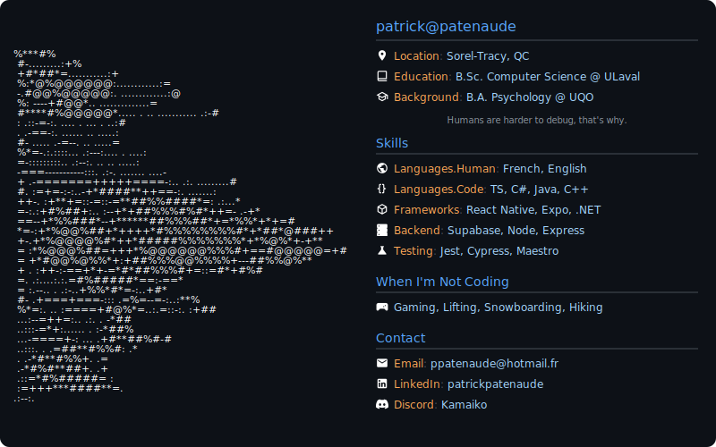

<!-- GitHub Profile -->
<picture>
  <source media="(prefers-color-scheme: dark)" srcset="dark_theme_v4.svg">
  <source media="(prefers-color-scheme: light)" srcset="light_theme_v4.svg">
  
</picture>

<picture>
  <source media="(prefers-color-scheme: dark)" srcset="https://github-readme-stats-mauve-one-58.vercel.app/api?username=Kamaiko&show_icons=true&theme=transparent&hide_border=true&title_color=58a6ff&text_color=ffffff&icon_color=ffa657&bg_color=0d1117&hide=stars&hide_rank=true&count_private=true&include_all_commits=true&custom_title=GitHub%20Stats&card_width=300">
  <source media="(prefers-color-scheme: light)" srcset="https://github-readme-stats-mauve-one-58.vercel.app/api?username=Kamaiko&show_icons=true&theme=default&hide_border=true&title_color=58a6ff&text_color=2f3337&icon_color=ffa657&bg_color=ffffff&hide=stars&hide_rank=true&count_private=true&include_all_commits=true&custom_title=GitHub%20Stats&card_width=300">
  
</picture>
<picture>
  <source media="(prefers-color-scheme: dark)" srcset="https://github-readme-stats-mauve-one-58.vercel.app/api/top-langs/?username=Kamaiko&layout=compact&theme=transparent&hide_border=true&langs_count=8&card_width=340&title_color=58a6ff&text_color=ffffff&icon_color=ffa657&bg_color=0d1117&custom_title=Most%20Used%20Languages">
  <source media="(prefers-color-scheme: light)" srcset="https://github-readme-stats-mauve-one-58.vercel.app/api/top-langs/?username=Kamaiko&layout=compact&theme=default&hide_border=true&langs_count=8&card_width=340&title_color=58a6ff&text_color=2f3337&icon_color=ffa657&bg_color=ffffff&custom_title=Most%20Used%20Languages">
  
</picture>

